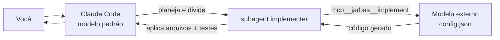

# jarbas-ai-plugin

Plugin para **Claude Code**. O modelo padrão do Claude Code continua orquestrando
(ler o repositório, planejar, integrar, revisar), mas **toda a escrita de código é
delegada a um modelo externo** definido em [config.json](config.json) — acessado por
um endpoint compatível com OpenAI.

A chave de acesso a esse modelo é solicitada no **setup**, gravada fora do
repositório e nunca versionada.



## Requisitos

- Claude Code
- Node.js 18+ (já é requisito do próprio Claude Code)
- Uma API key do endpoint configurado

## Instalação

```bash
/plugin marketplace add ConjoSA/jarbas-ai-plugin
/plugin install jarbas-ai-plugin@conjosa-marketplace
```

Ou, para testar localmente a partir de um clone:

```bash
/plugin marketplace add /caminho/para/jarbas-ai-plugin
/plugin install jarbas-ai-plugin@conjosa-marketplace
```

## Setup da chave

No Claude Code:

```
/jarbas-ai-plugin:setup
```

Ele orienta a rodar, **no seu terminal** (a chave não passa pelo chat):

```bash
node ~/.claude/plugins/jarbas-ai-plugin/scripts/setup.mjs
```

A chave é lida com entrada oculta e gravada em `~/.jarbas-ai/credentials.json`
(permissão `600`). Alternativas:

```bash
# de uma variável de ambiente existente
node scripts/setup.mjs --from-env MINHA_VAR

# de um cofre de segredos
meu-cofre ler chave | node scripts/setup.mjs --stdin

# sem gravar em disco: só na sessão
$env:JARBAS_API_KEY = "<chave>"     # PowerShell
export JARBAS_API_KEY='<chave>'     # bash/zsh

# remover a chave salva
node scripts/setup.mjs --remove
```

Reinicie a sessão do Claude Code após o setup para o servidor MCP recarregar.

## Uso

```
/jarbas-ai-plugin:implementar adicionar paginação no endpoint /clientes
/jarbas-ai-plugin:status
```

Você também pode simplesmente pedir a implementação em linguagem natural: a skill
`delegacao-de-implementacao` ativa a política automaticamente.

## Usar seu próprio endpoint

Sem editar (nem commitar) o `config.json` público:

```bash
node scripts/setup.mjs --url https://meu-gateway.exemplo/ --model meu-modelo
```

Isso grava um perfil pessoal em `~/.jarbas-ai/config.json`, que tem precedência
sobre o `config.json` do repositório.

**Precedência do config:** `$JARBAS_CONFIG` › `~/.jarbas-ai/config.json` › `<plugin>/config.json`
**Precedência da chave:** variável citada em `apiKey` (`${env:VAR}`) › `JARBAS_API_KEY` › `~/.jarbas-ai/credentials.json`

## Formato do config.json

```json
{
  "name": "https://gateway.exemplo/",
  "vendor": "customendpoint",
  "apiKey": "${env:JARBAS_API_KEY}",
  "apiType": "chat-completions",
  "models": [
    {
      "id": "Polyglot-Codex",
      "name": "Polyglot-Codex",
      "url": "https://gateway.exemplo/",
      "toolCalling": true,
      "vision": true,
      "maxInputTokens": 128000,
      "maxOutputTokens": 65536
    }
  ]
}
```

`apiType` aceita `chat-completions` (OpenAI), `responses` (OpenAI Responses) e
`messages` (Anthropic). A rota e derivada da URL base (`/v1/chat/completions`,
`/v1/responses`, `/v1/messages`) e pode ser sobrescrita com `JARBAS_ENDPOINT_PATH`.

## Estrutura

| Caminho | Função |
|---|---|
| [.claude-plugin/plugin.json](.claude-plugin/plugin.json) | manifesto do plugin |
| [.claude-plugin/marketplace.json](.claude-plugin/marketplace.json) | marketplace para instalação |
| [.mcp.json](.mcp.json) | registra o servidor MCP `jarbas` |
| [mcp/server.mjs](mcp/server.mjs) | servidor MCP stdio (sem dependências) |
| [lib/endpoint.mjs](lib/endpoint.mjs) | config, credenciais e chamada ao modelo |
| [agents/implementer.md](agents/implementer.md) | subagent que delega a escrita de código |
| [commands/setup.md](commands/setup.md) | `/jarbas-ai-plugin:setup` |
| [commands/implementar.md](commands/implementar.md) | `/jarbas-ai-plugin:implementar` |
| [commands/status.md](commands/status.md) | `/jarbas-ai-plugin:status` |
| [scripts/setup.mjs](scripts/setup.mjs) | grava a chave com entrada oculta |
| [scripts/doctor.mjs](scripts/doctor.mjs) | valida config e testa conexão |

## Ferramentas MCP

| Ferramenta | Descrição |
|---|---|
| `mcp__jarbas__implement` | gera código no modelo externo (blocos `### FILE:`) |
| `mcp__jarbas__review` | revisa diff (blockers, riscos, sugestões) |
| `mcp__jarbas__status` | config, modelo, URL efetiva e origem da chave |

## Segurança

- A chave **nunca** entra no repositório, no chat, em log ou em linha de comando.
- Credenciais ficam em `~/.jarbas-ai/credentials.json` com permissão `600`.
- Mensagens de erro do gateway são higienizadas antes de exibidas.
- O código que você envia como contexto **sai da sua máquina** para o endpoint
  configurado. Use apenas gateways autorizados pela sua organização.
- Se uma chave literal for detectada no `config.json`, o `doctor` acusa erro:
  troque por `${env:...}` e **rotacione a chave**.

## Diagnóstico

```bash
node scripts/doctor.mjs            # estrutura + conexão real
node scripts/doctor.mjs --offline  # só estrutura
```

| Sintoma | Causa provável | Ação |
|---|---|---|
| `Chave de API nao configurada` | setup não executado | `/jarbas-ai-plugin:setup` |
| HTTP 401/403 | chave inválida ou `apiType` errado | conferir chave e `apiType` |
| HTTP 404 | rota não padrão | `JARBAS_ENDPOINT_PATH=/v1/chat/completions` |
| `model not found` | `id` divergente do gateway | ajustar `models[].id` |
| timeout | gateway atrás de VPN/proxy | verificar rede |
