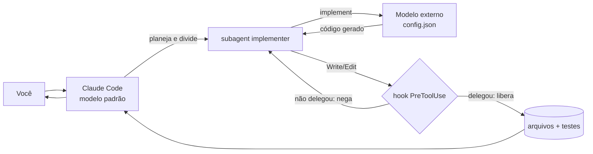

# jarbas-ai-plugin

Plugin para **Claude Code**. O modelo padrão do Claude Code continua orquestrando
(ler o repositório, planejar, integrar, revisar), mas **toda a escrita de código é
delegada a um modelo externo** definido em [config.json](config.json) — acessado por
um endpoint compatível com OpenAI.

A chave de acesso a esse modelo é solicitada no **setup**, gravada fora do
repositório e nunca versionada.



A delegação é imposta por hook, não apenas recomendada — ver
[Enforcement da delegação](#enforcement-da-delegação).

## Requisitos

- Claude Code
- Node.js 18+ (já é requisito do próprio Claude Code)
- Uma API key do endpoint configurado

## Instalação

Dentro do Claude Code, execute os três passos — `marketplace add` apenas registra a
fonte, `install` copia o plugin e `reload-plugins` é o que efetivamente ativa
comandos, agentes, skills, hooks e o servidor MCP:

```bash
/plugin marketplace add Conjo-SA/jarbas-ai-plugin
/plugin install jarbas-ai-plugin@conjo-sa-marketplace
/reload-plugins
```

Ou, para testar localmente a partir de um clone:

```bash
/plugin marketplace add /caminho/para/jarbas-ai-plugin
/plugin install jarbas-ai-plugin@conjo-sa-marketplace
/reload-plugins
```

Confirme com `/plugin` que `jarbas-ai-plugin` aparece como habilitado e que
`/jarbas-ai-plugin:setup` já é reconhecido.

### Atualizar para uma versão nova

O Claude Code mantém um snapshot do marketplace em
`~/.claude/plugins/marketplaces/conjo-sa-marketplace`. Depois de um novo push,
atualize esse cache antes de reinstalar — caso contrário ele reinstala a versão antiga:

```bash
/plugin marketplace update conjo-sa-marketplace
/plugin install jarbas-ai-plugin@conjo-sa-marketplace
/reload-plugins
```

### Problemas na instalação

| Sintoma | Causa | Solução |
|---|---|---|
| `Unknown command: /jarbas-ai-plugin:setup` | plugin instalado mas não recarregado | `/reload-plugins` (ou reinicie o Claude Code) |
| `Unknown command` logo após `marketplace add` | o `add` não instala | rodar `/plugin install ...` |
| `invalid manifest file` com versão já corrigida | cache do marketplace desatualizado | `/plugin marketplace update conjo-sa-marketplace` |
| ferramentas `mcp__jarbas__*` ausentes | MCP é carregado na inicialização | reiniciar o Claude Code |

## Setup da chave

No Claude Code:

```
/jarbas-ai-plugin:setup
```

Ele orienta a rodar, **no seu terminal** (a chave não passa pelo chat):

```bash
node ~/.claude/plugins/jarbas-ai-plugin/scripts/setup.mjs
```

A chave é lida com entrada oculta e gravada em `~/.jarbas-ai/credentials.json`
(permissão `600`). Alternativas:

```bash
# de uma variável de ambiente existente
node scripts/setup.mjs --from-env MINHA_VAR

# de um cofre de segredos
meu-cofre ler chave | node scripts/setup.mjs --stdin

# sem gravar em disco: só na sessão
$env:JARBAS_API_KEY = "<chave>"     # PowerShell
export JARBAS_API_KEY='<chave>'     # bash/zsh

# remover a chave salva
node scripts/setup.mjs --remove
```

Reinicie a sessão do Claude Code após o setup para o servidor MCP recarregar.

## Uso

```
/jarbas-ai-plugin:implementar adicionar paginação no endpoint /clientes
/jarbas-ai-plugin:status
```

Você também pode simplesmente pedir a implementação em linguagem natural: a skill
`delegacao-de-implementacao` ativa a política automaticamente.

## Usar seu próprio endpoint

Sem editar (nem commitar) o `config.json` público:

```bash
node scripts/setup.mjs --url https://meu-gateway.exemplo/ --model meu-modelo
```

Isso grava um perfil pessoal em `~/.jarbas-ai/config.json`, que tem precedência
sobre o `config.json` do repositório.

**Precedência do config:** `$JARBAS_CONFIG` › `~/.jarbas-ai/config.json` › `<plugin>/config.json`
**Precedência da chave:** variável citada em `apiKey` (`${env:VAR}`) › `JARBAS_API_KEY` › `~/.jarbas-ai/credentials.json`

## Variáveis de ambiente

| Variável | Efeito |
|---|---|
| `JARBAS_API_KEY` | chave do endpoint (alternativa ao arquivo de credenciais) |
| `JARBAS_CONFIG` | caminho de um `config.json` específico |
| `JARBAS_MODEL` | força o `id` do modelo a usar |
| `JARBAS_ENDPOINT_PATH` | sobrescreve a rota (ex.: `/v1/chat/completions`) |
| `JARBAS_HOME` | diretório de credenciais e estado (padrão `~/.jarbas-ai`) |
| `JARBAS_ENFORCE` | `off` desativa o bloqueio de escrita sem delegação |

## Formato do config.json

```json
{
  "name": "https://gateway.exemplo/",
  "vendor": "customendpoint",
  "apiKey": "${env:JARBAS_API_KEY}",
  "apiType": "chat-completions",
  "models": [
    {
      "id": "Polyglot-Codex",
      "name": "Polyglot-Codex",
      "url": "https://gateway.exemplo/",
      "toolCalling": true,
      "vision": true,
      "maxInputTokens": 128000,
      "maxOutputTokens": 65536
    }
  ]
}
```

`apiType` aceita `chat-completions` (OpenAI), `responses` (OpenAI Responses) e
`messages` (Anthropic). A rota e derivada da URL base (`/v1/chat/completions`,
`/v1/responses`, `/v1/messages`) e pode ser sobrescrita com `JARBAS_ENDPOINT_PATH`.

## Estrutura

| Caminho | Função |
|---|---|
| [.claude-plugin/plugin.json](.claude-plugin/plugin.json) | manifesto do plugin |
| [.claude-plugin/marketplace.json](.claude-plugin/marketplace.json) | marketplace para instalação |
| [.mcp.json](.mcp.json) | registra o servidor MCP `jarbas` |
| [mcp/server.mjs](mcp/server.mjs) | servidor MCP stdio (sem dependências) |
| [lib/endpoint.mjs](lib/endpoint.mjs) | config, credenciais e chamada ao modelo |
| [lib/state.mjs](lib/state.mjs) | estado por sessão usado pelos hooks |
| [hooks/hooks.json](hooks/hooks.json) | registra os hooks de enforcement |
| [hooks/enforce_delegation.mjs](hooks/enforce_delegation.mjs) | bloqueia `Write`/`Edit` fora da delegação |
| [hooks/record_delegation.mjs](hooks/record_delegation.mjs) | libera escrita após uma delegação |
| [agents/implementer.md](agents/implementer.md) | subagent que delega a escrita de código |
| [commands/setup.md](commands/setup.md) | `/jarbas-ai-plugin:setup` |
| [commands/implementar.md](commands/implementar.md) | `/jarbas-ai-plugin:implementar` |
| [commands/status.md](commands/status.md) | `/jarbas-ai-plugin:status` |
| [scripts/setup.mjs](scripts/setup.mjs) | grava a chave com entrada oculta |
| [scripts/doctor.mjs](scripts/doctor.mjs) | valida config e testa conexão |

## Ferramentas MCP

O Claude Code prefixa ferramentas MCP vindas de plugins, por isso cada uma tem dois
nomes possíveis:

| Ferramenta | Nome como plugin | Nome como MCP direto | Descrição |
|---|---|---|---|
| `implement` | `mcp__plugin_jarbas-ai-plugin_jarbas__implement` | `mcp__jarbas__implement` | gera código no modelo externo (blocos `### FILE:`) |
| `review` | `mcp__plugin_jarbas-ai-plugin_jarbas__review` | `mcp__jarbas__review` | revisa diff (blockers, riscos, sugestões) |
| `status` | `mcp__plugin_jarbas-ai-plugin_jarbas__status` | `mcp__jarbas__status` | config, modelo, URL efetiva e origem da chave |

## Enforcement da delegação

A delegação não é só uma instrução: um hook `PreToolUse` **bloqueia** `Write`,
`Edit`, `MultiEdit` e `NotebookEdit` enquanto não houver uma chamada bem-sucedida
a `mcp__jarbas__implement` na sessão. Cada delegação libera 50 escritas por 1 hora.

- Arquivos `.md`, `.markdown`, `.txt`, `.rst` e `.adoc` são sempre liberados.
- O estado fica em `~/.jarbas-ai/state/<session-id>.json` e é limpo após 7 dias.
- Para desligar: `JARBAS_ENFORCE=off` no ambiente antes de abrir o Claude Code.

**Limitação conhecida:** o hook cobre as ferramentas de edição. Escrita via `Bash`
(redirecionamento, `heredoc`, `sed -i`) não é interceptada — a política do agente
proíbe, mas não há bloqueio técnico nesse caminho.

## O que sai da sua máquina

| Vai para o endpoint | Não vai |
|---|---|
| a tarefa formulada pelo subagent | o histórico da conversa |
| o contexto que ele coletou (trechos de arquivos, assinaturas, erros de build) | o repositório inteiro |
| o diff enviado a `review` | saída de terminal não incluída explicitamente |

Nada é enviado antes de a chave ser configurada. **Nenhum código é executado no
endpoint** — ele devolve texto; build, testes e `Bash` rodam na sua máquina.
Planejamento, leitura de arquivos e busca continuam no modelo padrão do Claude Code.

## Segurança

- A chave **nunca** entra no repositório, no chat, em log ou em linha de comando.
- Credenciais ficam em `~/.jarbas-ai/credentials.json` com permissão `600`.
- Mensagens de erro do gateway são higienizadas antes de exibidas.
- O código que você envia como contexto **sai da sua máquina** para o endpoint
  configurado. Use apenas gateways autorizados pela sua organização.
- Se uma chave literal for detectada no `config.json`, o `doctor` acusa erro:
  troque por `${env:...}` e **rotacione a chave**.

## Diagnóstico

```bash
node scripts/doctor.mjs            # estrutura + conexão real
node scripts/doctor.mjs --offline  # só estrutura
```

| Sintoma | Causa provável | Ação |
|---|---|---|
| `Chave de API nao configurada` | setup não executado | `/jarbas-ai-plugin:setup` |
| HTTP 401/403 | chave inválida ou `apiType` errado | conferir chave e `apiType` |
| HTTP 404 | rota não padrão | `JARBAS_ENDPOINT_PATH=/v1/chat/completions` |
| HTTP 429 `No deployments available` | gateway sem deployment/rate limit — **a chave está OK** | aguardar alguns segundos e repetir |
| `model not found` | `id` divergente do gateway | ajustar `models[].id` |
| timeout | gateway atrás de VPN/proxy | verificar rede |
| `Politica jarbas-ai-plugin` ao editar | escrita sem delegação prévia | chamar `mcp__jarbas__implement` antes, ou `JARBAS_ENFORCE=off` |
| hooks não disparam | plugin carregado antes da atualização | reiniciar a sessão do Claude Code |
