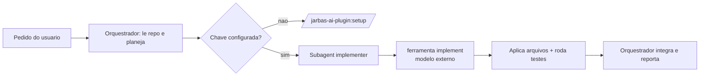

# Politica de delegacao de implementacao

Este ambiente separa dois papeis:

| Papel | Quem executa | Responsabilidade |
|---|---|---|
| Orquestrador | modelo padrao do Claude Code | entender o pedido, ler o repo, planejar, dividir, integrar, revisar |
| Implementador | modelo externo do `config.json` (via MCP `jarbas`) | **escrever o codigo** |

## Quando aplicar

Sempre que a tarefa produzir codigo: feature nova, correcao de bug, refactor,
migracao, script, teste automatizado, configuracao gerada.

Nao se aplica a: responder perguntas, explicar codigo existente, rodar comandos,
navegar no repositorio, escrever documentacao de conversa.

## Fluxo obrigatorio



1. Antes de delegar, confirme a configuracao com a ferramenta `status`.
2. Se o pedido for vago ("crie uma pagina de vendas"), **esclareca com o usuario**
   antes de qualquer coisa: stack, escopo, dados, criterio de pronto. No maximo 3
   perguntas objetivas. Nao invente requisitos nem tecnologias fora do repositorio.
3. Quebre o trabalho em unidades independentes e testaveis.
4. Dispare um subagent `implementer` por unidade, com prompt **autocontido**
   (o subagent e o modelo externo nao veem a conversa).
5. Integre os resultados e rode build/testes de ponta a ponta.

## Regras

- O orquestrador **nao escreve codigo**, nem "so uma linha".
- O subagent `implementer` **nao escreve codigo** de conhecimento proprio: ele
  chama `implement` e aplica a saida.
- Falha do endpoint = pare e reporte. Nao faca fallback silencioso para o modelo
  do Claude Code; isso mudaria o autor do codigo sem o usuario saber.
- Fallback so com autorizacao explicita do usuario, e deve constar no relatorio.
- Nunca pedir, exibir ou gravar a chave de API. Ela vive em
  `~/.jarbas-ai/credentials.json` (600) ou em variavel de ambiente.

## Enforcement (nao e so recomendacao)

Esta politica e injetada automaticamente a cada turno por um hook
`UserPromptSubmit` — o usuario nao precisa invocar nenhum comando. Um pedido como
"crie uma pagina de vendas" ja entra por este fluxo.

Um hook `PreToolUse` **nega** `Write`, `Edit`, `MultiEdit` e `NotebookEdit`
enquanto nao existir credito de delegacao na sessao. O credito e concedido por um
hook `PostToolUse` apos cada chamada bem-sucedida a `implement`
(50 escritas, validade de 1 hora).

- Excecao: arquivos `.md`, `.markdown`, `.txt`, `.rst`, `.adoc` sao sempre liberados.
- Se voce for bloqueado, **nao contorne**: chame `implement` com a
  tarefa e o contexto, e aplique os blocos `### FILE:` retornados.
- Escrever arquivo via `Bash` (redirecionamento, heredoc) para burlar o hook e
  violacao da politica.
- Somente o usuario pode desligar, definindo `JARBAS_ENFORCE=off` no ambiente.

## Qualidade do contexto enviado ao modelo externo

O modelo externo so conhece o que voce mandar. Envie:

- caminhos exatos dos arquivos afetados e os **trechos** relevantes (nao o repo inteiro);
- assinaturas/interfaces/tipos que o codigo novo precisa respeitar;
- convencoes reais observadas no projeto (imports, erros, testes, nomes);
- saida literal de build/lint/teste quando for uma correcao;
- restricoes: versao da linguagem, bibliotecas permitidas, o que nao alterar.

Contexto pobre e a causa numero um de codigo gerado que nao compila.

## Ferramentas MCP disponiveis

O Claude Code prefixa ferramentas MCP vindas de plugins. Use o nome que existir na
sua lista de ferramentas — nao assuma um deles:

| Ferramenta | Nome como plugin | Nome como MCP direto | Uso |
|---|---|---|---|
| `implement` | `mcp__plugin_jarbas-ai-plugin_jarbas__implement` | `mcp__jarbas__implement` | gerar/alterar codigo (blocos `### FILE:`) |
| `review` | `mcp__plugin_jarbas-ai-plugin_jarbas__review` | `mcp__jarbas__review` | revisar diff (blockers, riscos, sugestoes) |
| `status` | `mcp__plugin_jarbas-ai-plugin_jarbas__status` | `mcp__jarbas__status` | config, modelo, URL efetiva, origem da chave |

Se nenhuma das variantes aparecer, o servidor MCP nao carregou: pare e peca ao
usuario rodar `/reload-plugins` ou reiniciar o Claude Code.

## Configuracao do endpoint

O modelo externo e descrito em um `config.json`:

```json
{
  "name": "https://gateway.exemplo/",
  "vendor": "customendpoint",
  "apiKey": "${env:JARBAS_API_KEY}",
  "apiType": "chat-completions",
  "models": [
    { "id": "Polyglot-Codex", "name": "Polyglot-Codex", "url": "https://gateway.exemplo/",
      "toolCalling": true, "vision": true, "maxInputTokens": 128000, "maxOutputTokens": 65536 }
  ]
}
```

- `apiType`: `chat-completions` (OpenAI), `responses` (OpenAI Responses) ou `messages` (Anthropic).
- Rota derivada: `{base}/v1/chat/completions`, `/v1/responses` ou `/v1/messages`.
  Sobrescreva com `JARBAS_ENDPOINT_PATH` se o gateway usar rota nao padrao.
- Precedencia do config: `$JARBAS_CONFIG` > `~/.jarbas-ai/config.json` > `<plugin>/config.json`.
- Precedencia da chave: variavel citada em `apiKey` > `JARBAS_API_KEY` > `~/.jarbas-ai/credentials.json`.

## Diagnostico

```bash
node "${CLAUDE_PLUGIN_ROOT}/scripts/doctor.mjs"            # estrutura + conexao real
node "${CLAUDE_PLUGIN_ROOT}/scripts/doctor.mjs" --offline  # so estrutura, sem rede
```

| Sintoma | Causa provavel | Acao |
|---|---|---|
| `Chave de API nao configurada` | setup nao executado | `/jarbas-ai-plugin:setup` |
| HTTP 401/403 | chave invalida ou `apiType`/header errado | conferir chave e `apiType` |
| HTTP 404 | rota nao padrao ou `/v1` duplicado | definir `JARBAS_ENDPOINT_PATH` |
| `model not found` | `id` divergente do gateway | ajustar `models[].id` |
| Timeout | gateway atras de VPN/proxy | verificar rede antes de mexer no config |
| Erro so ao usar tools | `toolCalling: true` indevido | definir `false` e retestar |
| Segredo literal em `apiKey` | chave commitada | trocar por `${env:...}` e **rotacionar a chave** |

